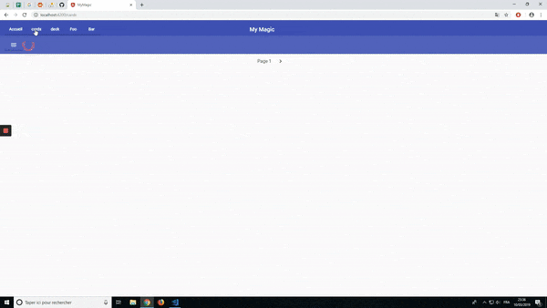

# Magic The Gathering
First Angular 7 app web / web mobile, using Typescript and Cordova

## Demo

## Installing
Clone repository git clone https://github.com/Ironbou/magic-the-gathering.git

Install packages : npm install

Build : npm run build

Add plateform for device : npm run cordova platform add android

## Start
Open in browser : npm run start

Open in detected device : npm run cordova run android --device